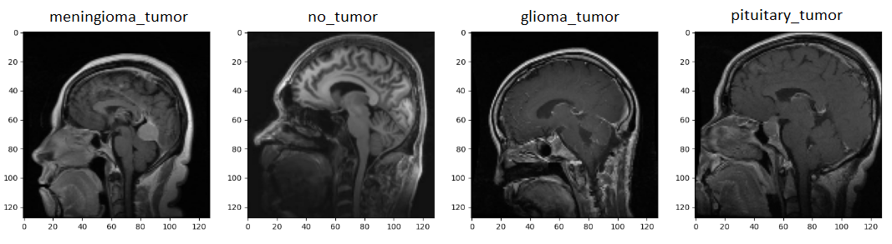

# 🧠 Brain Tumor Classification  

📌 *This repository is part of my engineering thesis, where I compare different models to find the best solution for brain tumor classification in real-world scenarios.*  

---

## 🔍 Project Overview  
This project focuses on classifying brain tumors using deep learning techniques. The goal is to evaluate the performance of different models and analyze their effectiveness on new, unseen images to simulate the application of the model in real-world medical cases.  

---

## 📊 Key Aspects of the Study  
✔ **Developing a custom classification model** for brain tumors  
✔ **Comparing it with existing models** from others people research  
✔ **Analyzing key metrics** (Accuracy, Precision, Recall) across different datasets  
✔ **Drawing conclusions** based on performance evaluation  

---

## 📂 Repository Contents  
📁 **`model/`** → Jupyter notebook with my model training and evaluation  
📁 **`images/`** → Sample of each class (dataset not included)  
📁 **`thesis/`** → My engineering thesis thesis with all detailed descriptions of data sets, models and conclusions (written in Polish)

---

## 🛠 Technologies Used  
- TensorFlow / Keras     
- NumPy / Pandas / Matplotlib 
- Scikit-learn 

---

🚀 **Feel free to explore, contribute, or suggest improvements!**  
